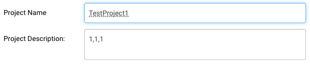
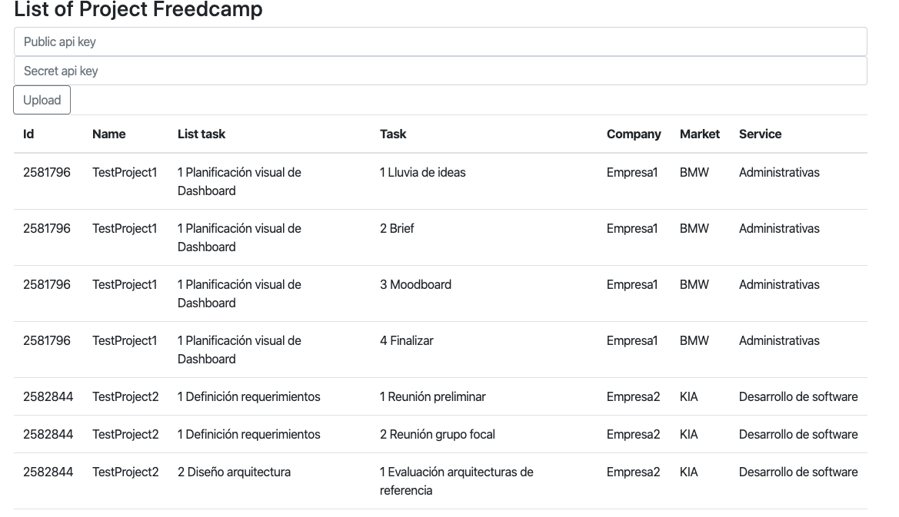

# SpringBoot-Api-Rest-TechnicalTest-API-FREEDCAMP
Prueba técnica para validar habilidades de programación con el propósito de aplicar a una vacante de trabajo para el cargo de Desarrollador BackEnd Freelance.

## Enunciado de la prueba técnica

Para esta prueba utilizaremos un escenario con Freedcamp. Una herramienta para el desarrollo de proyectos que permite colaboración por equipos y definición especifica de procesos y tareas. Tiene una version gratuita, y para esta prueba debe crear una cuenta y dos proyectos con las siguientes caracteristicas:

La estructura del proyecto en freedcamp debe tener: Dos listas de tareas como mínimo, y una serie de tareas específicas despues (mínimo dos por lista). Una vez creados los proyectos en freedcamp, debe crear una app web, que tenga autenticación de usuarios (Login/Registro) y permita consultar la información de Freedcamp (API FREEDCAMP) procesando los datos del lado del servidor, con su respectiva API REST. Para esto puede usar las herramientas y tecnologías que prefiera (Lenguajes y frameworks).

Por otro lado, la app gestiona información empresarial que está organizada de la siguiente manera: Existen empresas, mercados, servicios y tareas específicas. Debe diseñar y crear una base de datos con esas características.

TIP: Use las descripciones de proyecto dentro de freedcamp para enlazar la información.

La estructura de información indica que existen dos empresas principales (EMPRESA1 Y EMPRESA2), los mercados, servicios y a su vez tareas específicas (que se crean en freedcamp por lo general) pueden compartirse desde la base de datos. Estos servicios deben conectar a un mercado, sin embargo, un mismo servicio se puede prestar en ambas empresas para distintos mercados. Ej. Desarrollo de software es un servicio que se brinda a BMW y MINI desde EMPRESA2, pero por parte de EMPRESA1 se brinda a VOLVO y KIA.

Finalmente la app debe consultar la cuenta de freedcamp, almacenar la información en una base de datos (usted decide si es relacional o no relacional) y traer los datos de los dos proyectos con sus respectivas listas y tareas. Esta información debe estar asignada a una empresa, mercado y servicio pertinente.

El diseño de esta base de datos debe permitir tener N cantidad de servicios y tareas. Es decir, no debe existir problema en caso de que el cliente quiera agregar más del uno o del otro.

Como es una prueba enfocada a Back end, no es necesario profundizar en los estilos de la página sino en el tratamiento de los datos desde el lado del servidor. Eso si, la información debe mostrarse de forma legible desde la app.

## Configuración de ambiente

Con el proposito de disminuir la compleja tarea de configuración del ambiente de desarrollo se opto por utilizar la tecnología Spring-boot que permite ejecutar aplicaciones Stand-alone. Aunque, también es posible ejecutar las mismas aplicaciones en entornos web con ciertos ajustes de configuración. A continuación, se describirá la manera como debe ser puesta en funcionamiento.

### Maven

Si usted no ha tenido la oportunidad de haber utilizado una herramienta de software, para la gestión y construcción de proyectos, como Maven no se preocupe para el proposito del proyecto es necesario que tenga en cuenta que debe realizar los siguientes pasos para descargar librerias que el proyecto necesita y para validar que el proyecto no presente ninguna inconsistencia. Luego, de descargar el proyecto, en Eclipse, proceda a realizar las siguientes acciones:

- Descargar librerias: en Eclipse, ubicarse encima de la raíz del proyecto y dar boton derecho, buscar la opción en el menú desplegable, "Maven" y luego seleccionar la opción "Update Project...". En ese instante empezara a descargar las librerias necesarias, tomara unos minutos hacerlo.

- Validar que el proyecto no presente inconsistencias: en Eclipse, ubicarse encima de la raíz del proyecto y dar boton derecho, buscar la opción en el menú desplegable, "Run As" y luego seleccionar la opción "Maven install". Al final, en la consola aparecera un mensaje en mayuscula similar a este: "BUILD SUCCESS" si todo esta correcto.

### Base de datos relacional

Se utilizo la base de datos relacional embebida que ofrece la tecnología Spring-boot con el fin de agilizar el proceso de implementación. Cabe señalar, que esta base de datos es temporal, es decir los datos regresaran al estado original respetando el script inicial de carga, cuando la aplicación nuevamente es desplegada. De acuerdo con las especificaciones técnicas, las instrucciones DDL se incluyen en el archivo schema.sql y las DML en el archivo data.sql, dentro de la carpeta:

`/api/src/main/resources`

El modelo datos definido para la aplicación esta definido en el siguiente modelo entidad relación.

### Enlazar información

Con el proposito de asignar la empresa, el mercado y el servicio al proyecto en Freedcamp, se utilizo el campo: "Project Description". El primer numero representa el consecutivo asignado a la empresa en base de datos, el segundo representa el mercado y el tercero el servicio.

## Iniciar aplicación

Buscar en el proyecto, el archivo:

`com.freedcamp.api.ApiApplication.java`

Dar boton derecho encima de este y buscar la opción en el menú desplegable "Run As", luego seleccionar la opción "Java Application". Despues, en la consola de Eclipse usted podra apreciar como un servidor embebido, propio de la tecnología Spring-boot, inicia. Hay que tener en cuenta, que el servidor utiliza por default el puerto 8080, si actualmente lo esta utilizando opte por dejarlo libre o considere cambiar el puerto en el siguiente archivo de propiedades:

`/src/main/resources/application.properties`

Adicione una linea al final, como el ejemplo:

`server.port=8090`

## Usar aplicación

#### Para utilizar la aplicación usar la siguiente url:

`http://localhost:8080/`

Para cargar los datos desde Freedcamp, es necesario digitar el Public api key y el Secret api key en los campos corrrespondientes, posteriormente dar clic en el botón "Upload". De esta manera la aplicación invoca los servicios api expuestos por Freedcamp asociados a estas llaves y luego inserta los datos devueltos en base de datos.

> NOTA: si no cuenta con las key's, considere utilizar las siguientes de pruebas:
>- Public api key: 7e9df0d89f77a1c897c28b770911e0e7f8cf46db
>- Secret api key: 4fafefc314c726237b23c73b6ae925dbf08fc15b

#### Los api rest de Freedcamp invocados fueron:

`https://freedcamp.com/api/v1/projects`

Trae información basica del proyecto también, el consecutivo asignado en la plataforma. Este consecutivo es necesario para traer las tareas asociadas al proyecto.

`https://freedcamp.com/api/v1/tasks`

Trae información básica de las tareas. Es necesario conocer el consecutivo del proyecto.

Más información de los api rest en el siguiente enlace:

https://freedcamp.com/Mobile_7Yh/iOS_application_6zp/wiki/wiki_public/view/DFaab#description
